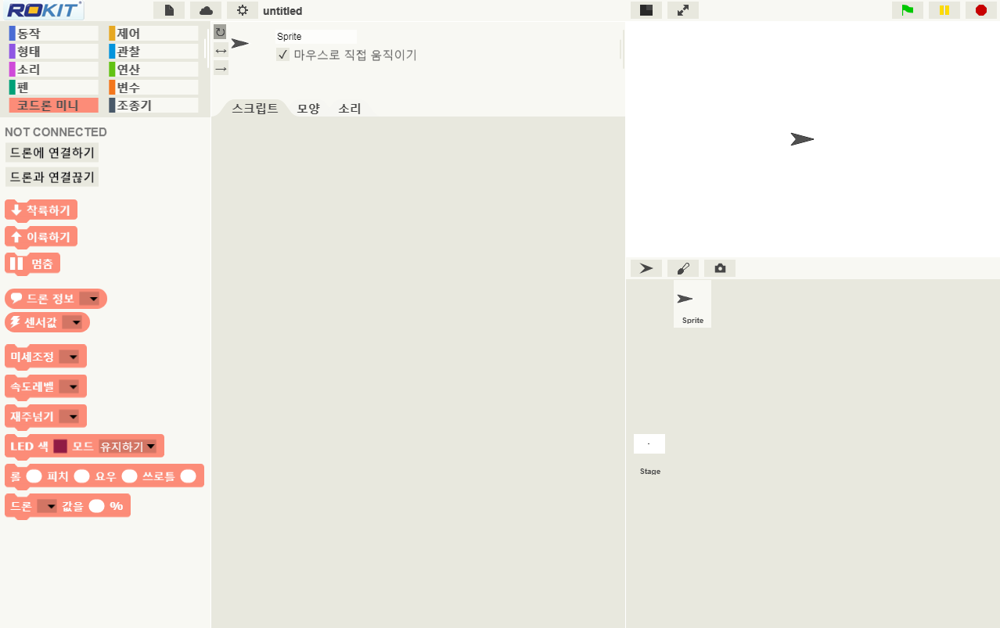

# CoDroneMini CoDrone Mini：教育编码无人机 

> 迷你编码，这是一种智能编码无人机，可以学习无人机和编码！

这是一款高性能无人机，从8岁到专业人士都可以享受。轻松将您的想法编码为块类型，单击键盘按钮，它们将按照无人机的想法自动飞行。 CoDrone Mini旨在使无人机专家和编码专家比现有CoDrone系列更容易，更安全。即使您不必从教科书开始硬编码或从昂贵的无人机开始，也可以使用CoDrone Mini立即开始编码和无人机！

编码可以使用各种开源软件完成，从基于暂存块的程序到初学者再到Python。

# 功能

CoDrone Mini 拥有无人机应有的一切。

无人机和遥控器可进行各种控制和维护。

  

# 规格

## 实际配置

# 杠杆

可以通过四种方式使用Coderon Mini：远程控制，虚拟控制，PC监视控制和块程序。

## 遥控器

使用操纵杆的无人机飞行可以在任何地方进行控制。

* **Pairing** :  第一步是将无人机连接到遥控器。打开无人机电源并在20秒内摇动它。然后，无人机的LED将闪烁蓝色和红色，在此状态下，按遥控器上的Pairing（配对）按钮几秒钟。连接后，无人机的LED将停止并且遥控器的蜂鸣声将响起。

* **Reset**  : 在平面上校准无人机。将无人机放在地板上，然后按一下遥控器上的RESET按钮，然后无人机上的LED会反应并再次停止。

* **Start** : 按下右侧按钮约4秒钟，无人机将起飞并自动悬停

* **Flying** : 왼쪽 조이스틱을 이용하여 상승/하강/좌회전/우회전를 , 오른쪽 조이스틱을  이용 하여 전진/후진/좌이동/우이동을 합니다.

* **Stop** : 원하는 목표지역에 착륙하기 위하여 약 4초간 오른쪽 측면에 있는 버튼을 누르면 천천히 내려와 착륙합니다.

> [드론 조종법 및 퀵매뉴얼 PDF 다운로드 받기](https://github.com/EBWon/robolink/blob/master/codronemini/pdf/remotecontroller.pdf)

## 드론시뮬레이터 가상 비행

조이스틱을 이용한 가상 드론 비행으로 드론을 실제 날리지 않아도 모니터상의 드론을 다양한 방법으로 조종하고 연습할 수 있습니다.

* **Connection** : PC와 리모콘을 USB케이블로 연결하고 드론시뮬레이터를 실행하고 우측상단의 ConnectC 버튼에서 포트를 연결하고 Training버튼을 눌러 가상 드론 조종화면으로 넘어갑니다.

* **Virtual Flight** : 실제 드론을 조종하는것처럼 유선으로 연결된 리모콘을 통해 화면의 드론을 제어해보세요.

> [드론 시뮬레이터 PDF 매뉴얼 다운로드 받기](https://github.com/EBWon/robolink/blob/master/codronemini/pdf/simulator.pdf)

## 드론시뮬레이터 모니터링 비행

PC를 통해서 드론의 다양한 센서값 및 드론상태를 모니터링하고 실제 키보드를 이용하여 드론을 제어하고 자율 비행까지도 손쉽게 해볼수 있습니다.

* **Connection** : PC와 리모콘을 USB케이블로 연결하고 드론시뮬레이터를 실행하고 우측상단의 ConnectionD 버튼에서 포트를 연결하면 드론 모니터링 화면으로 넘어갑니다.

* **Play** : 드론의 상태값을 모니터링해보고 실제 키보드로 드론을 비행해보고, 순차비행프로그램 툴을 통해 자율 비행도 해볼 수 있습니다.

## 로킷 브릭

마우스를 활용한 드래그&드랍 블록형 코딩 프로그래밍을 이용하여 다양한  드론 제어와 실험, 게임, 미션등을 무궁무진하게 해볼 수 있습니다.

* **Selection** : PC와 리모콘을 USB케이블로 연결하고 RokitBrick을 실행하고 드론종류에서 코드론 미니를 선택하고 SELECT 버튼을 누릅니다.

* **Connection & Play** : 좌측 상단의 블록군에서 “코드론 미니”탭을 누르고 바로 밑에 드론에 연결하기를 눌러서 포트를 연결하고 원하는 블록을  중앙 스크립트에 이동하여 다양한 드론 제어를 실시간으로 할 수 있습니다. 

> [로킷 브릭 PDF 매뉴얼 다운로드 받기](https://github.com/EBWon/robolink/blob/master/codronemini/pdf/rokit.pdf)