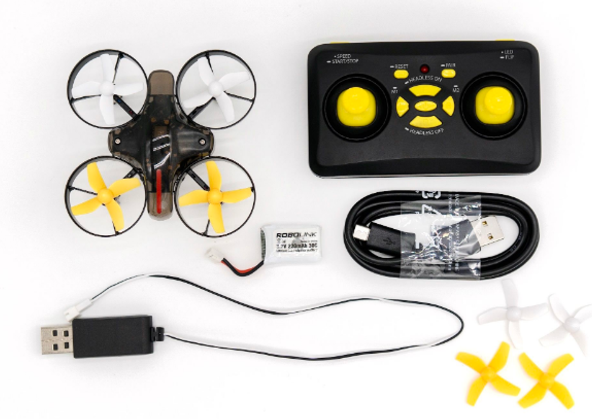

# CoDroneMini CoDrone Mini：教育编码无人机 

> 迷你编码，这是一种智能编码无人机，可以学习无人机和编码！

这是一款高性能无人机，从8岁到专业人士都可以享受。轻松将您的想法编码为块类型，单击键盘按钮，它们将按照无人机的想法自动飞行。 CoDrone Mini旨在使无人机专家和编码专家比现有CoDrone系列更容易，更安全。即使您不必从教科书开始硬编码或从昂贵的无人机开始，也可以使用CoDrone Mini立即开始编码和无人机！

编码可以使用各种开源软件完成，从基于暂存块的程序到初学者再到Python。

# 功能

CoDrone Mini 拥有无人机应有的一切。

无人机和遥控器可进行各种控制和维护。

  

# 规格

## 实际配置

# 杠杆

可以通过四种方式使用CoDrone Mini：远程控制，虚拟控制，PC监视控制和块程序。

## 遥控器

使用操纵杆的无人机飞行可以在任何地方进行控制。

* **Pairing** :  第一步是将无人机连接到遥控器。打开无人机电源并在20秒内摇动它。然后，无人机的LED将闪烁蓝色和红色，在此状态下，按遥控器上的Pairing（配对）按钮几秒钟。连接后，无人机的LED将停止并且遥控器的蜂鸣声将响起。

* **Reset**  : 在平面上校准无人机。将无人机放在地板上，然后按一下遥控器上的RESET按钮，然后无人机上的LED会反应并再次停止。

* **Start** : 按下右侧按钮约4秒钟，无人机将起飞并自动悬停

* **Flying** : 使用左操纵杆向上/下/左/右旋转，并使用右操纵杆前进/后/左/右。

* **Stop** : 按下右侧按钮约4秒钟，以着陆在所需的目标区域，然后缓慢下降以着陆。

> [下载无人机控制和快速手册PDF](https://github.com/EBWon/manual_cn/raw/master/codronemini/pdf/编程迷你无人机使用说明书.pdf)

## 无人机模拟器虚拟飞行

带有操纵杆的虚拟无人机飞行使您可以通过多种方式控制和练习显示器上的无人机，而无需实际飞行。

* **Connection** : 用USB电缆连接PC和遥控器，运行无人机模拟器，从右上角的ConnectC按钮连接端口，然后按Training按钮进入虚拟无人机控制屏幕。

* **Virtual Flight** : 用有线遥控器控制屏幕上的无人机，就像控制真正的无人机一样。

> [下载Drone Simulator PDF手册](https://github.com/EBWon/manual_cn/raw/master/codronemini/pdf/simulator.pdf)

## 无人机模拟器监控飞行

您可以通过PC监控无人机的各种传感器值和无人机状态，使用真正的键盘控制无人机，甚至可以自主飞行。

* **Connection** : 用USB电缆连接PC和遥控器，运行无人机模拟器，然后从右上角的ConnectionD按钮连接端口，以进入无人机监控屏幕。

* **Play** : 您可以监视无人机的状态，使用真实的键盘监视无人机的飞行，甚至可以使用顺序飞行程序工具监视自动飞行。

## 火箭砖

使用鼠标拖放块编码的编程，可以控制各种无人机，实验，游戏和任务。

* **Selection** : 用USB电缆连接PC和遥控器，运行RokitBrick，从无人机类型中选择CoDrone Mini，然后按SELECT按钮。

* **Connection & Play** : 点击左上方模块组中的“ CoDrone Mini”选项卡，然后点击“ Connect”以直接在下面的无人机上连接端口，并将所需的模块移动到中央脚本以实时控制各种无人机。可以

> [下载Rocket Brick PDF手册](https://github.com/EBWon/manual_cn/raw/master/codronemini/pdf/rokit.pdf)